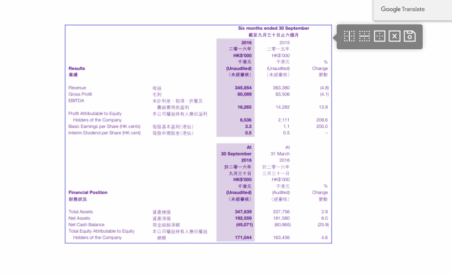

# qcc-table-mending

# 介绍
  一款对图片支持线框裁剪的vue组件， 输出lines和boxs 位置信息
  
  通过canvas渲染图片，通过鼠标点击实现的表格数据进行补线，删线，合并单元格等操作 ，从而提高表格的可读性和完整性。补线完成后本发明会返回表格所有线框的坐标位置

# 环境
```
  node>=12.x
```

# 样例



# 开始

```javascript
npm install qcc-table-mending --save
```

# 使用
```javascript
import TableMendingVue from 'qcc-table-mending ';
Vue.use(TableMendingVue)
```

# 参数
* 参数

  |  名称    | 类型  | 样例  | 描述  |
  |  ----    | ----  |----  |----  |
  | image    | String |'../xxx./demo.png' |图片,支持图片地址或base64格式 |
  | data     | Object |{lines： {'cols': [], 'rows': []}, boxs: []} |线段，线框信息 |
  | options  | Object |options = {isShowGuideLine, maxWidth,linewidth, linesColor} | 其他参数 |


* 事件
  |  名称       | 回调  |描述  |
  |  --------   | ----  | ----  |
  | rowadd      | 当前线段位置 [x1,y1,x2,y2] |加横线 |
  | coladd      | 当前线段位置 [x1,y1,x2,y2] |加竖线 |
  | mergelines  | 合并的单元格位置[[x1,y1,x2,y2]] |合并线 |
  | deleteline  | 删除的线段位置[x1,y1,x2,y2] |删除线 |
  | savemending | 线和框信息 {lines: {}, boxs: []} |保存裁剪信息 |

# 样例
```html
 <TableMendingVue
    :image = image
    :data = "data"
    :options = "{
      isShowGuideLine: isShowGuideLine,
      maxWidth: maxWidth,
      linewidth: linewidth,
      linesColor: linesColor
    }"
    @rowAdd = "rowAdd"
    @colAdd = "colAdd"
    @mergeLines = "mergeLines"
    @deleteLine = "deleteLine"
    @saveMending = "saveMending"
  />
  ```
